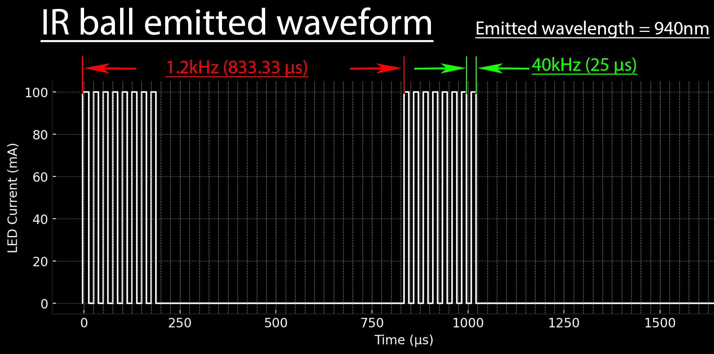
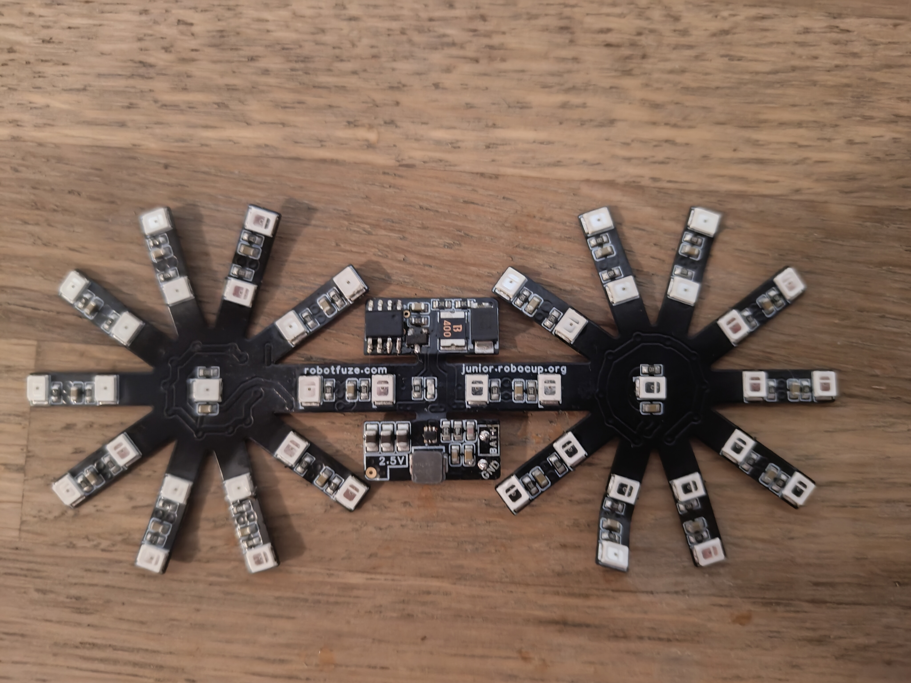

# IR golf ball

# What / Why it is?
A golf size ball emiting IR light powered by 18350 Li-Ion battery with 40khz modulation 
(8 pulzes of 40khz then off with period of 1.2khz)

# How to get it?
You will be able to buy it soon, for now we are taking preorders [here](https://docs.google.com/forms/d/e/1FAIpQLSeDNluafNvnX1WBIk5zJzcXsfOrKENFUOebmqeOT6po7Bbjzg/viewform?usp=sf_link) cost is 20$ per ball build without battery and 15$ for kit.

# How to make it your self from scratch
## Step 1: Get all materials

### 1. Flex PCB
We recomend to order flexPCB from eather JLCPCB or PCBWAY, both do have sponsorship programs so you might be able to get it for free. Depending on your buget and skill set also think about ordering stencil (all componentc are posible to solder by hand soledring but it is easier to do it with stencil)

https://www.pcbway.com/sponsor.html

https://jlcpcb.com/help/article/how-to-apply-for-free-pcb

You can find all files neaded for manufacturing [here](https://github.com/robocup-junior/ir-golf-ball/tree/main/jlcpcb) in this repo.

### 2. Electrical components
<table>
  <thead>
    <tr>
      <th>Image</th>
      <th>Quantity</th>
      <th>Comment</th>
      <th>Footprint</th>
      <th>Value</th>
      <th>LCSC</th>
      <th>Mouser</th>
      <th>DigiKey</th>
    </tr>
  </thead>
  <tbody>
    <tr>
      <td></td>
      <td>24</td>
      <td>22uF</td>
      <td>C0603</td>
      <td>22uF</td>
      <td>GRM188R60J226MEA0D</td>
      <td>GRM188R60J226MEA0D</td>
      <td>GRM188R60J226MEA0D</td>
    </tr>
    <tr>
      <td></td>
      <td>3</td>
      <td>47uF</td>
      <td>C0805</td>
      <td>47uF</td>
      <td>C2012X5R1A476MTJ00E</td>
      <td>C2012X5R1A476M125AC</td>
      <td>C2012X5R1A476M125AC</td>
    </tr>
    <tr>
      <td></td>
      <td>1</td>
      <td>4.7nF</td>
      <td>C0603</td>
      <td>4.7nF</td>
      <td>CC0603KRX7R9BB472</td>
      <td>CC0603KRX7R9BB472</td>
      <td>CC0603KRX7R9BB472</td>
    </tr>
    <tr>
      <td></td>
      <td>1</td>
      <td>120pF</td>
      <td>C0603</td>
      <td>120pF</td>
      <td>CL10C121JB8NNNC</td>
      <td>CL10C121JB8NNNC</td>
      <td>CL10C121JB8NNNC</td>
    </tr>
    <tr>
      <td></td>
      <td>1</td>
      <td>SS1045-SMB</td>
      <td>SMB_L4.4-W3.6-LS5.3-RD</td>
      <td></td>
      <td>SS1045-SMB</td>
      <td>VSSB7L45-M3/52T</td>
      <td>VSSB7L45-M3/52T</td>
    </tr>
    <tr>
      <td></td>
      <td>1</td>
      <td>220nH</td>
      <td>IND-SMD_L4.1-W4.1</td>
      <td>220nH</td>
      <td>IHLP1616BZERR22M01</td>
      <td>IHLP1616BZERR22M01</td>
      <td>IHLP1616BZERR22M01</td>
    </tr>
    <tr>
      <td></td>
      <td>42</td>
      <td>XL-2835IR-T202</td>
      <td>SMD2835</td>
      <td></td>
      <td>XL-2835IR-T202(recomended)</td>
      <td>XXX</td>
      <td>SE03-LP2835S-1400-940</td>
    </tr>
    <tr>
      <td></td>
      <td>1</td>
      <td>XL-1608SURC-06</td>
      <td>LED0603</td>
      <td></td>
      <td>XL-1608SURC-06</td>
      <td>SML-D12V8WT86</td>
      <td>SML-D12V8WT86</td>
    </tr>
    <tr>
      <td></td>
      <td>1</td>
      <td>AP3404</td>
      <td>SOT-23-3</td>
      <td></td>
      <td>AP3404</td>
      <td>AP3404</td>
      <td>AP3404</td>
    </tr>
    <tr>
      <td></td>
      <td>42</td>
      <td>10Ω</td>
      <td>R0603</td>
      <td>10Ω</td>
      <td>0603WAF100JT5E</td>
      <td>0603WAF100JT5E</td>
      <td>0603WAF100JT5E</td>
    </tr>
    <tr>
      <td></td>
      <td>3</td>
      <td>10k</td>
      <td>R0603</td>
      <td>10k</td>
      <td>RC0603FR-0710KL</td>
      <td>RC0603FR-0710KL</td>
      <td>RC0603FR-0710KL</td>
    </tr>
    <tr>
      <td></td>
      <td>1</td>
      <td>316kΩ</td>
      <td>R0603</td>
      <td>316kΩ</td>
      <td>RC0603FR-07316KL</td>
      <td>RC0603FR-07316KL</td>
      <td>RC0603FR-07316KL</td>
    </tr>
    <tr>
      <td></td>
      <td>1</td>
      <td>100kΩ</td>
      <td>R0603</td>
      <td>100kΩ</td>
      <td>RC0603FR-07100KL</td>
      <td>RC0603FR-07100KL</td>
      <td>RC0603FR-07100KL</td>
    </tr>
    <tr>
      <td></td>
      <td>1</td>
      <td>100Ω</td>
      <td>R0603</td>
      <td>100Ω</td>
      <td>0603WAJ0101T5E</td>
      <td>0603WAJ0101T5E</td>
      <td>0603WAJ0101T5E</td>
    </tr>
    <tr>
      <td></td>
      <td>1</td>
      <td>ATTINY202-SSNR</td>
      <td>SOIC-8</td>
      <td></td>
      <td>ATTINY202-SSNR</td>
      <td>ATTINY202-SSNR</td>
      <td>ATTINY202-SSNR</td>
    </tr>
    <tr>
      <td></td>
      <td>1</td>
      <td>TPS62A06DRLR</td>
      <td>SOT-563-6</td>
      <td></td>
      <td>TPS62A06DRLR</td>
      <td>TPS62A06DRLR</td>
      <td>TPS62A06DRLR</td>
    </tr>
    <tr>
      <td></td>
      <td>1</td>
      <td>1812L400/12GR</td>
      <td>F1812</td>
      <td></td>
      <td>1812L400/12GR</td>
      <td>MF-MSMF260-2</td>
      <td>MF-MSMF260-2</td>
    </tr>
    <tr>
      <td></td>
      <td>1</td>
      <td>181 Keystone Spring</td>
      <td>AAA spring</td>
      <td></td>
      <td>181 Keystone Spring</td>
      <td>181 Keystone Spring</td>
      <td>181 Keystone Spring</td>
    </tr>
  </tbody>
</table>

We recomend ordering from LCSC but you can find all the componets on other sites as well (Mouser,Digikey...), only one problematick component is LEDs, there are some alternatives but IR emision might be slightli diferent. For finding best suplier for you, we recomend using https://octopart.com/ and checking out list of eqvivalent componts (TODO list of eqvivalent components and selection criterias)

### 3. Mechanical components
#### Filament

Shells are 3D printed, after lot of testing we found out that best option in general is using [Spectrum Premium PCTG 1.75mm TRANSPARENT ORANGE 1kg](https://shop.spectrumfilaments.com/product-eng-1517-Filament-Spectrum-Premium-PCTG-1-75mm-TRANSPARENT-ORANGE-1kg.html) for good optical properties/cheap/easy to print/mechanical properties similar to PC.

#### Magnets
For magnets we are using 6 [8mm*5mm*5mm](https://www.unimagnet.cz/neodymovy-magnet-kvadr-8-5-5-mm-pozinkovany-sila-1-1-kg_z905/) neodimium magnets. 

#### 4mm balls

For ball balancing we are using 4mm steel balls, you schold be able to find local distributor, we buy them from https://www.temu.com/cz-en/1000pcs-3-5mm-3mm-4-5mm-4mm-steel-ball--ball-bearing-g-601099529146981.html

#### Glue

Any superglue should work fine but we recomend UHU MAX Repair

### 4. Battery

We are using 18350 Li-Ion battery. We recomend capacity ranging from 1100mAh to 1200mAh (for balance reasons) with weigt as close to 24g as posible . It schold be easy to find in your local vape shop or battery store. Dont forget to get charger if you dont have one.

## Step 2: Print 3D shells

You can find stl files as well as sliced model in prushaslicer in 3d in this repo. Main thing to look for is to use enought of separation distance for suports (0.25mm) and to set temperature of bad to 80 C and nozle to 255 C.
Also dont forget to print counterwight for balance. All the files can be found [here](https://github.com/robocup-junior/ir-golf-ball/blob/main/3d/) . Time to print 1 shell is around 1:30h. For counterweight it is around 30min

## Step 3: Asemble PCBs
While your 3d printer is working you can asemble PCBs. It can be done by hand but stencil is more convinient. We recomend to place coil as last component so you will be able to rework regulator solder joints if neaded after reflow.

## Step 4: Program AtTiny
This step is not neaded when you did buy a kit from us. 
The best way to aproach this is to watch this video: https://www.youtube.com/watch?v=AL9vK_xMt4E
and upload code as mention in the video. Dont forget to contect 5V to 2.5V trace when programing so UDPI voltages do match. Also dont forgete to change freqvenci to 5MHz for attiny being able to work at 2.5V.

## Step 5: Magnets and counterweights
First remove suports from 3d printed shell.

Then place balls in midle of every balancing pocket

Put glue on magnet

Insert magnet

And insert top balls and repeat

Do it twice, and then atach counter weight to PCB

## Step 6: Insert PCB
Insert PCB into a 3D printed schells and make shure that baterry fits corectly. You can regulate contact of batery with PCB by adding or removing solder from battery contact pads that are on the PCB.

## Step 7: Test
Test your ball if it glows using your mobile phone.

The end (:
