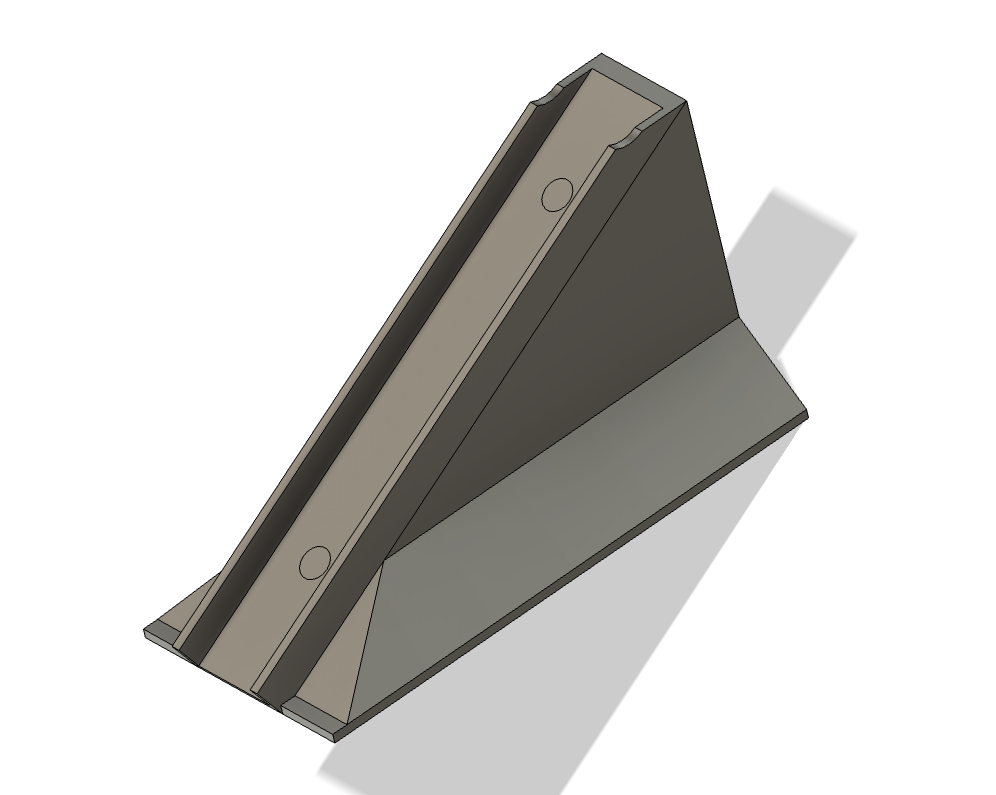

# How to Measure the Balance: Deriving Principal Moments of Inertia from Inertia Tensor

The balance of the ball is important since if it's not balanced, the ball does not roll straight. 
In this document, we discuss how to evaluate the balance of the ball from logical and physical perspectives. 

As preparation, measure the weight of each part and set the density based on the volume of objects in Autodesk Fusion. 
By left-clicking on Project -> Properties, you can see the inertia tensor as `Moment of Inertia at Center of Mass (g mm^2)`

The inertia tensor of a rigid body is represented as a 3×3 symmetric matrix:

$$
\mathbf{I} = \begin{pmatrix}
I_{xx} & I_{xy} & I_{xz} \\
I_{xy} & I_{yy} & I_{yz} \\
I_{xz} & I_{yz} & I_{zz}
\end{pmatrix}
$$

Where:
- **Diagonal components** $I_{xx}, I_{yy}, I_{zz}$: Moments of inertia about each axis
- **Off-diagonal components** $I_{xy}, I_{xz}, I_{yz}$: Products of inertia

## 2. Principal Moments of Inertia (Eigenvalue Problem)

The principal moments of inertia $I_1, I_2, I_3$ are obtained as the **eigenvalues** of the inertia tensor.

Eigenvalue equation:

$$
\det(\mathbf{I} - \lambda \mathbf{E}) = 0
$$

Expanding yields the **characteristic equation** (cubic equation):

$$
\lambda^3 - \text{tr}(\mathbf{I})\lambda^2 + \frac{1}{2}\left[(\text{tr}\mathbf{I})^2 - \text{tr}(\mathbf{I}^2)\right]\lambda - \det(\mathbf{I}) = 0
$$

Or more explicitly:

$$
\begin{vmatrix}
I_{xx} - \lambda & I_{xy} & I_{xz} \\
I_{xy} & I_{yy} - \lambda & I_{yz} \\
I_{xz} & I_{yz} & I_{zz} - \lambda
\end{vmatrix} = 0
$$

The three real roots $\lambda_1, \lambda_2, \lambda_3$ of this cubic equation are the principal moments of inertia:

$$
I_1 = \lambda_{\min}, \quad I_2 = \lambda_{\text{mid}}, \quad I_3 = \lambda_{\max}
$$

## 3. Coefficients of the Characteristic Equation

The characteristic equation can be written as:

$$
\lambda^3 - A\lambda^2 + B\lambda - C = 0
$$

Where:

$$
A = I_{xx} + I_{yy} + I_{zz} = \text{tr}(\mathbf{I})
$$

$$
B = I_{xx}I_{yy} + I_{yy}I_{zz} + I_{zz}I_{xx} - I_{xy}^2 - I_{yz}^2 - I_{xz}^2
$$

$$
C = \det(\mathbf{I})
$$

## 4. Principal Moment Difference (Isotropy Metrics)

Once the principal moments are obtained, the deviation from spherical symmetry can be evaluated using the following metrics:

### 4.1 Moment Difference

$$
\varepsilon = \frac{I_{\max} - I_{\min}}{I_{\min}} \times 100\%
$$

Or equivalently:

$$
\varepsilon = \left(\frac{I_3}{I_1} - 1\right) \times 100\%
$$

**This Moment Difference should be as small as possible!**  
**Less difference means more equality of inertia on each axis, which makes the ball roll straighter!!**

### 4.2 Spread

$$
\Delta I = I_{\max} - I_{\min} = I_3 - I_1
$$

## (Reference) 5. Perfect Sphere Case

For a homogeneous perfect sphere:

$$
I_1 = I_2 = I_3 = \frac{2}{5}mr^2
$$

In this case:
- Moment difference $\varepsilon = 0\%$
- Spread $\Delta I = 0$
- The inertia tensor is diagonal (all off-diagonal components are zero)

## 6. Numerical Example
Let us calculate the Principal Moments of Inertia and Moment Difference by using the inertia tensor from v2 model.  

Input data:

$$
\mathbf{I}_{CM} = \begin{pmatrix}
8869.184 & 0.440 & -4.100 \\
0.440 & 8864.378 & 2.508 \\
-4.100 & 2.508 & 8816.923
\end{pmatrix}
$$

Eigenvalue calculation results:

| Principal Moment | Value (g·mm²) |
|------------------|---------------|
| $I_1$ (min) | 8816.469 |
| $I_2$ (mid) | 8864.500 |
| $I_3$ (max) | 8869.516 |

Moment difference:

$$
\varepsilon = \left(\frac{8869.516}{8816.469} - 1\right) \times 100\% = 0.60\%
$$

# Test the Balance in Real Environment
In addition to the logic above, evaluating the balance of the assembled ball in your hand is also important.

## Preparation
Print this model with your 3D printer. Any type of filament is fine. 

[slope_base.stl](./slope_base.stl)  
[slope_top.stl](./slope_top.stl)

Then, label each axis on the ball like this. The side where the counter weight is located should be labeled as `Y-`

## Test
Put the ball on the slope and roll it 6 times by:
1. Face `Z+` on top, `X-` on right towards the rolling direction (Ixx-CW)
2. Face `Z+` on top, `X+` on right towards the rolling direction (Ixx-CCW)
3. Face `Z+` on top, `Y-` on right towards the rolling direction (Iyy-CW)
4. Face `Z+` on top, `Y+` on right towards the rolling direction (Iyy-CCW)
5. Face `X+` on top, `Z-` on right towards the rolling direction (Izz-CW)
6. Face `X+` on top, `Z+` on right towards the rolling direction (Izz-CCW)

Then you can evaluate which axis has an uneven moment of inertia. 
If there is an unbalanced axis, the ball goes in the opposite direction when you compare CW and CCW. For instance, if the paths of `Ixx-CW` and `Ixx-CCW` go in opposite directions, either side of `X+` or `X-` is heavier or lighter and makes the ball unbalanced. 

Testing it on a flat and smooth surface is theoretically correct, but on rough carpet like a soccer field, small errors may not matter. So I recommend testing it on carpet and seeing how practical it is in RCJ. 

